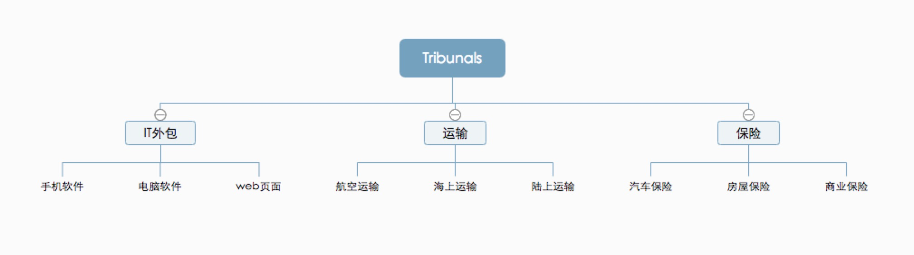
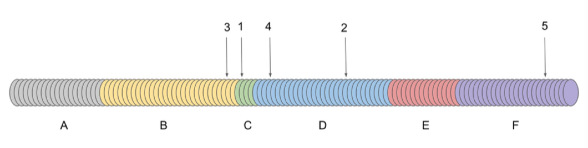

# `Tribunals`白皮书
* 版本v0.0.1

### 摘要
`Tribunals`是一个建立在`Ethereum`1, `EOS`, `Tron`, `VeChain`等公链平台之上的跨多链`Dapp`系统，该系统作为一个去中心化的仲裁平台来仲裁各种合同中的争议，无论合同是非常简单还是高度复杂。该系统基于博弈论激励措施让陪审员公平准确地处理争议案件，并以去中心化的方式快速、便宜的得到最终裁决结果。

## 1. 简介  
`“Whoever controls the courts, controls the state”. Aristotle.`   

世界范围内的全球化和数字化的进程正在加速，跨越国家和地区的在线交易呈指数增长。在不远的将来，大多数商品，劳动力和资本将通过分散在全球平台进行分配。争议肯定会出现。例如，Airbnb的客人将声称租用的房子不是“如图中所示”；众筹平台的支持者觉得团队未能兑现承诺要求退款；客户觉得IT技术外包公司编写的代码质量堪忧而要拒绝支付尾款。
智能合约可以按预定程序执行，但不能进行主观判断或保证区块链链外的事物的真实性。对于实时运营的分散式全球经济而言，现有的争议解决技术太慢，太昂贵甚至无法实现。快速，廉价，透明，可靠和分散的争议解决机制，对智能合同的可执行性做出最终判断，是区块链时代的关键机构。
`Tribunals`是一个多功能法院系统的决策协议，能够解决各种争议。它是一个自治组织，作为一个分散的第三方来处理各种合同中的争议，从非常简单到高度复杂的合同。仲裁过程的每一步（确保证据，选择陪审员等）都是完全自动化的。`Tribunals`并不依赖少数人的诚实，而依赖于博弈论的经济激励。
法院是一个引擎，是从一系列令人困惑的线索中找出事件真相的工具。代理人（陪审团）遵循输入（证据）用于产生输出（决定）的程序。`Tribunals`利用众包、区块链和博弈理论的技术开发了一个司法系统，以安全、廉价的方式做出真正的决定。

## 2. 用例

小明是一位中国企业家领袖。在`P2P`众包平台上发布了一个工作，为他的公司建立一个新的网站，他聘请了来自印度的程序员A。在他们就价格，条款和条件达成一致后，A开始工作。几周后，他交付了产品。但小明并不满意。他认为A的工作质量远低于预期。A回答他完全按照协议做了。小明很沮丧。他不能聘请一位律师，因为律师费用高昂,而他支付给A的工作费用也就几百美金。
如果合同有条款规定，如果发生争议，它将由`Tribunals`解决，该怎么办？ 小明点击了一个按钮，上面写着“发送给`Tribunals`”并填写一份简单表格。
在数千公里外，Bob是一名软件开发人员，他在回家的路上正在检查`Tribunals`网站，想找一份仲裁工作。作为软件开发纠纷的陪审员，每年在全职工作之外赚取数千美元。他擅长`html`，`css`，`javascrip`t和网页设计技能。他的账户存入了一些`token`。他存入的`token`越多，他就越有可能被选为陪审员。
大约一个小时后，一封电子邮件发送到了Bob的收件箱：“你被选为网站质量纠纷的陪审员。在此处下载证据。您有三天时间来提交您的决定“。来俄罗斯和日本德国希腊在`Tribunals`网站寻求仲裁工作的软件开发人员也收到了这样的邮件。他们是从近3000名候选人中随机选出的。他们永远不会相互了解，但他们将合作解决小明和A之间的纠纷。在家里的沙发上，Bob分析了正确的证据和决策。
两天后，在N个陪审团投票后，小明和A收到一封电子邮件：“陪审团已经为小明作出裁决。该网站未按照双方同意的条款和条件交付。智能合约已经把钱转移给了小明“。陪审员因工作而获得奖励，案件已经结案。

## 3 博弈论原理：`SchellingCoin`机制

博弈论专家`Thomas Schelling`开发了`Schelling Point`（也称为`Focal Points`）（18）的概念，作为一种解决方案，人们倾向于在缺乏沟通的情况下协调他们的行为，因为它总是是自然的或与他们相关的。`Schelling`用以下示例说明了这个概念：“明天你必须在纽约见到一个陌生人。你何时何地见到他？“虽然城市中的任何地点和时间都可以成为解决方案，但最常见的答案是“中央车站信息亭的中午”。没有任何东西可以在中央车站中午获得更高的概率（任何其他地方和时间都会很好，只要两个代理商在那里协调），但它作为聚会场所的传统使其成为一个自然的焦点。
`Schelling Point`通常在沟通不可能时出现，但也有可能在沟通可能的情况下，任何一方都无法向对方提供相信他所说的是真实的理由（14）。基于`Schelling Points`的概念，以太坊创始人`Vitalik Buterin`提出了`Schelling Coin`（8）的创建，这是一个与经济激励相提并论的标志。如果我们想知道今天早上是否在巴黎下雨，我们可以问谢林硬币的每个主人：“今天早上巴黎下雨了吗？是还是不是”。每个硬币持有人通过无记名投票进行投票，在他们全部投票后，结果显露出来。投票占多数的政党将获得10％的硬币奖励。投票与大多数人不同的政党会损失10％的硬币。
托马斯谢林（18）描述了“每个人对另一个人期望他期望做什么的期望的焦点”。谢林硬币利用这一原则为许多不相识或相互信任的代理商提供激励，以说出真相。我们希望代理商投票给出真正的答案，因为他们希望其他人投票给出真正的答案，因为他们期望其他人投票给出真正的答案。 。 。在这个简单的案例中，`Schelling Point`是诚实的。
谢林硬币机制已被用于分散的神谕和预测市场（19）（16）（3）。基本的见解是，与他人一致投票是一种必须激励的理想行为。 `Kleros`的激励设计基于类似于Schelling Coin的机制，稍作修改，以解决有关扩展，主观性和隐私的若干特定挑战，以使代理商参与适当的行为。

## 3 项目描述
### 3.1 仲裁合约
`Tribunals`是一个选择加入的法院系统。其他智能合约必须指定`Tribunals`作为仲裁员。当他们选择加入时，合同创建者会选择多少陪审员以及哪个法院将裁定他们的合同 发生争议的情况1.他们的想法是，他们会选择一种专门针对合同主题的法院。软件开发合同将选择软件开发法院，即保险合同将选择保险法院等。下图显示了用户可以选择的法庭的例子。 `Tribunals`团队正在使用`Tribunals`作为争议解决机制制定一系列标准合同。

#### 3.1.1 陪审员的可选项
合同将指定陪审员投票的选项。 在介绍性示例中，选项可以是：“偿还小明”，“给A额外一周完成网站”和“付费给A”和“付部分费用给A,剩余部分偿还给小明”。
智能合约还将在裁决完成后指定合同的行为。 在示例中：
* 将资金转移到小明地址。   
* “给A额外一周的时间来完成网站”会阻止新的争议一周，并从进一步的争议中删除此选项。
* 将资金转移到A地址。
* 转移部分资金到A地址,剩余转移到小明地址。

#### 3.1.2 隐私
解决争议可能需要当事人向陪审员披露保密信息。为了防止外部人员访问此信息，自然语言合同（英语或其他）和陪审员投票选项的标签不放在区块链上。创建合同时，创建者提交哈希（合同文本、选项列表, 随机数）（其中合同文本是合同的纯英文文本，选项列表可以由陪审员投票的选项标签，使用随机数以避免被攻击。
合同创建者使用非对称加密向每一方发送{合同文本，选项列表，随机数}。这样，各方可以验证提交的是否与发送给他们的内容相对应。
如果发生争议，各方可以向陪审员透露{合同文本，选项列表，随机数}，以验证他们是否与提交的哈希相对应。他们使用非对称加密这样
只有陪审员才会收到合同和选项的文本。所有这些步骤都由用户在使用`Tribunals`时处理。

### 3.2 选取陪审员
#### 3.2.1 系统token：Tic
用户在担任`Tribunals`陪审员方面具有经济利益：每位陪审员收取为其工作所获得的仲裁费。
被指定为特定争议的陪审员的概率与陪审员存入的`token`数量成正比。他存放的`token`数量越高，他作为陪审员被抽出的概率就越高。没有存放`token`的陪审员没有被选取的机会。这可以防止选择不活跃的陪审员。
`token`在`Tribunals`设计中扮演两个关键功能。
第一，他们保护系统免受`sybil`攻击（Douceur, J. R. The sybil attack. In Revised Papers from the First International Workshop on Peer-to-Peer Systems (London, UK, UK, 2002), IPTPS ’01, Springer-Verlag, pp. 251–260）。如果陪审员只是随机抽取，恶意方可以创建大量地址，这样每次抽取将会有更高的概率抽中。通过被抽取的次数超过所有诚实的陪审员，恶意方将控制系统。
恶意方想控制系统需要持有市面上代笔数的51%这需要很高昂的代价。
第二，`token`为陪审员提供了诚实投票的动机，让不诚实的陪审员将部分存款支付给诚实的陪审员。

#### 3.2.2陪审团的选择

在候选人自行选择特定的法院并存入其`token`后，将随机进行陪审员的最终选择。作为陪审员的概率与所存`token`的数量成正比。理论上，一个候选人可能会因为一个特定的争议而被多次吸引（但实际上不太可能）。用户因争议而被抽取的次数（称为权重）决定了他将在争议中获得的票数，以及在`token`重新分配期间他将赢得或失去的`token`数量。

假设6位`token`持有人签署了争议协议，共存入10000`token`，分配如下：

| Token Owner | Activated | Start | End | Weight |
| ------ | ------ | ------ |  ------ |  ------ |
| A | 1000 | 0 | 999 | 0 |
| B | 1500 | 1000 | 2499 | 1 |
| C | 500 | 2500 | 2999 | 1 |
| D | 3000 | 3000 | 5999 | 2 |
| E | 1500 | 6000 | 7499 | 0 |
| F | 2500 | 7500 | 9999 | 1 |

存放和提取的`token示例`

对于需要5票的争议，从已存入的10000个token中提取5个token。提取的token（如上图所示）编号为2519、4953、2264、3342和9531。token所有者B、C和F的权重为1。token所有者d的权重为2。法院作出最终裁决后，可以收回已交存的token（由不诚实的陪审员支付的除外）。

#### 4.2.3 随机数生成

为了选取陪审员，我们需要一个过程来绘制抵抗操纵的随机数。 使用协议在双方（4）之间创建随机数不起作用。 攻击者可以在他自己之间制造纠纷，多次选择自己为陪审员，并选择另一名受害陪审员。 然后，他将以一种他们被认为是连贯的方式协调他自己的选票而不是受害者的选票，以便在重新分配pinakion时从受害者那里窃取token（参见奖励制度一节）。

通过顺序工作证明（10）生成随机数等 使用类似于B¨unz的方案，。 （11）适用于利用证明区块链5。
1. 初始化：我们从seed = blockhash开始，让所有各方输入一个值localRandom来改变种子，使seed = hash（seed，localRandom）。这允许任何一方改变种子。我们希望任何一方都不会选择种子。这样每个方都可以更改种子，但不能选择它，因为选择特定种子攻击将要求攻击者确定localRandom，使得哈希（种子，localRandom）= seedAttack由于加密哈希函数的前映像阻力而难以实现。
2. 计算主随机值：与随机数有关的每一方都对种子进行顺序工作证明。从h0 = seed开始，他们计算hn + 1 = hash（hn）up hd，其中d是难度参数。计算高清需要时间并确保在某人获得种子知识并获得结果之间经过一定时间。难度d是固定的，使得在初始化阶段期间没有硬件可以计算hd。因为在开始下一步之前我们需要上一步的结果，所以这个过程不能并行化。这意味着任何一方都无法获得结果
明显快于其他人。
3. 在区块链上获得结果：每个参与方都可以发布他们找到的存款。然后其他方可以使用交互式验证来反驳错误的结果（17）。它包括对攻击者结果的二分法搜索。如果攻击者提交虚假的高清，诚实的一方可以向他询问他的hd / 2值。如果他给出错误的值，则会出错
在攻击者中h0和hd / 2之间的值。如果他给出正确的值，则hd / 2和hd之间存在误差。无论哪种方式，搜索空间除以2。诚实的一方在缩小的空间（错误在哪里）继续这个过程，直到剩下两个值。然后诚实的一方可以展示x，使得攻击者答案中的hx + 1≠hash（hx）使他的答案无效。
答案无效的当事人将失去押金。其中一部分被烧毁，另一部分被授予使其无效的一方。请注意，使错误结果无效所需的交互次数仅为O（log（d））。  
4. 获取所有随机值：在诚实的各方使结果无效之后，只剩下正确的结果。从这个主随机值我们得到所有随机值，使得rn = hash（hd，n）。只要至少有一个诚实的一方，这个过程的输出就是一个随机数。计算顺序工作证明和交互式验证需要时间。但是，对于大多数争议，从争议开始的那一刻起等待几个小时，陪审员被抽出的那一刻也不会成为问题。但是，对于会话时间特别短的一些子场（例如，子网解决网络中的争议到区块链Oracle），这种随机数生成方法可能太慢。这些子场可以使用基于阈值签名的不太安全但更快的随机数发生器（5）。有关此过程的更多详细信息将在以后的工作中提供。  
5. 工作证明区块链中，阻塞仍无法准确预测，我们可以删除此步骤并仅使用blockhash作为种子。 但是以太坊已经计划改用Proof-Of-Stake。
   
### 4.3 投票

在评估证据后，陪审员承诺（6）对其中一个选项投票。 他们提交哈希（投票，盐，地址）。 salt是本地生成的随机值，以便添加熵以防止使用彩虹表。地址是陪审员的以太坊地址，为了使每个陪审员的承诺不同，这是必要的，从而防止陪审员复制另一个陪审员的承诺。当投票结束时，他们会透露{vote，salt}，并且Kleros智能合约会验证它是否符合承诺。未能透露投票权的陪审员将受到处罚（见激励措施系统部分）。
陪审员作出承诺后，他的投票无法改变。但是其他陪审员或当事人仍然看不到它。这可以防止陪审员投票影响其他陪审员的投票。
陪审员仍然可以宣布他们以某种方式投票，但他们不能让其他陪审员有理由认为他们所说的是真的。这是Schelling Point出现的一个重要特征。如果陪审员知道其他陪审员的投票，他们可以像他们一样投票而不是投票给谢林点。
我们让任何一方能够在投票结束前向克莱罗斯展示陪审员的承诺，从而窃取了这位陪审员的利益，并使这位陪审员的投票无效。
如果陪审员想要向另一方透露其投票，则有两种选择：
1. 仅显示其投票结果。该党不会有任何证据证明它以这种方式投票。该陪审员可以撒谎，而另一方无法核实。
2. 揭示其投票及其承诺。该党将有投票证明，但该党也可以偷走这个陪审员的蠢货。
这项计划可以防止陪审员无理透露他们的投票。 6
陪审员还必须为其投票提供理由。
所有陪审员投票后（或在投票结束后），陪审员都会透露投票结果。陪审员未能透露投票的人将受到处罚。最后，投票汇总，智能合约执行。具有最高票数的选项被视为获胜选项。 7

6. 陪审员仍有可能提供有关其投票的见解。 例如，通过与他们自己签订一份智能合约，承诺以某种方式投票，如果投票方式不同则烧掉存款。 关于这些行为的讨论将包含在未来的工作中。
7. 我们正在考虑比首先通过的方法更复杂的方法。 但挑战在于应对它们导致的激励矩阵的不对称性。 这种不对称可能会影响谢林点。 例如，在可以排序的值的情况下取中值可能导致偏向中心值。
### 4.4 仲裁费
为了补偿陪审员的工作并避免攻击者向系统发送垃圾邮件，制造争议和上诉需要仲裁费用。 每个陪审员将支付由争议解决的子场确定的费用。 可仲裁的智能合约将决定哪一方将支付仲裁费用。
规则可以很简单。 例如，他们可能要求创建争议的一方或上诉方支付费用。 但我们可能会想到更复杂的规则来创造更好的激励机制。 例如：
* 首先，各方将在智能合约中存入相当于仲裁费用的金额。 如果一方未能这样做，聪明的合同将认为法院裁定支付了存入仲裁费用的一方（甚至没有在法庭上引起争议）。 如果双方都存入资金，则在争议结束时，获胜方将获得补偿。
* 在上诉中，双方都必须存入仲裁费用。 上诉人还必须按照上诉费用的比例存入额外的股份，这笔费用将提供给赢得争议的一方。 这样，如果一方提出无聊的上诉伤害对方，对方将获得时间损失的赔偿，而如果上诉最终被裁定为合法，则该股权将归还给上诉人8    

关于可仲裁智能合约所定义的费用结构的讨论将成为未来工作的一部分。

### 4.5 上诉

如果在陪审团作出决定后，一方不满意（因为它认为结果不公平），它可以上诉并再次裁定争议。每个新的申诉实例将有两倍
以前的陪审员人数加一人。由于陪审员人数增加，必须支付上诉费（上诉费=新陪审员费用 - 每个陪审员费用 - 已经支付的费用）。
如果判决被上诉，则上诉级别的陪审员不会被支付（但由于token重新分配，他们仍然受到争议的影响）。这激励陪审员解释他们的裁决。
如果给出适当的解释，当事人不太可能上诉，因为他们有更多的机会确信决策是公平的。
由于向每位陪审员支付了仲裁费用并且上诉人数增加了指数，仲裁费用随着上诉人数呈指数上升。这意味着，在大多数情况下，当事人不会上诉，或者只会适度上诉。但是，吸引大量次数的可能性对于防止攻击者贿赂陪审员很重要（参见贿赂抵抗部分）。

### 4.6 激励制度

陪审员统治争议以收取仲裁费用。他们被鼓励诚实地统治，因为在争执结束后，投票与团体不一致的陪审员将失去一些token，这些token将被送给连贯的陪审员。
在Kleros就争议做出决定后，token被解冻并在陪审员中重新分配。重新分配机制的灵感来自SchellingCoin9，陪审员根据他们的投票是否与其他陪审员保持一致而获得或失去token。
如果评委会成员投票赞成多数选择的选项，我们将假设一名评委会成员投票一致。每个不相干陪审员损失的token数量为：α·min激活⋅重量。 α参数确定裁定后要重新分配的令牌数。它是一个内生变量，将由治理机制定义为投票内部动态的结果环境。
min激活参数是可以在子场中激活的最小令牌数量。令牌在相关方之间按比例分配。如果他们以多数票10投票，则认为缔约方是连贯的。您可以在图4中看到令牌重新分配的示例.Jurors可能无法透露他们的投票。
1465/5000
为了抑制这种行为，不泄露投票的惩罚是不连贯投票的惩罚（2·α·min激活权重）的两倍。这激励陪审员总是透露他们的投票。
如果是上诉，则根据最终申诉结果在每个级别重新分配token。如果在一个级别没有人连贯地投票，那么token将被提供给获胜方。
当没有攻击时，各方都会激励他们投票，他们认为，其他方认为，其他方认为。 。 。是诚实和公平的。在Kleros，Schelling Point是诚实和公平的。有人可能认为这些决策是主观的（例如，与预测市场的谢林硬币机制相比），不会出现谢林点。在（18）中，Thomas Schelling进行的非正式实验表明，在大多数情况下，并不存在所有各方公开的Schelling Point。但谢林发现，某些选项比其他选项更有可能被选中。因此，即使不存在特别明显的选择，一些选项将被视为更有可能被其他方选择并且将被有效地选择。我们不能指望陪审员100％正确。没有仲裁程序可以实现这一点。有时候，诚实的陪审员会丢钱币。但只要总体上他们失去的价值低于他们作为仲裁费用赢得的价值，以及作为其他不连贯政党的硬币，该系统将起作用

8. 这要求争议后保险公司为没有足够资金存入上诉和股份存款的当事人提供保险。如果争议获胜，保险公司将支付一方的押金以换取部分股权。所有这些都可以强制执行智能合约。  
9. 见前一部分工作：SchellingCoin机制  
10. Token重新分配机制仍在积极研究中，我们可能会在未来的工作中使用更复杂的协议。

图4：七名陪审员投票后的令牌重新分配。 token是从陪审员那里重新分配的，这些陪审员与那些投票连贯的陪审员投票无关。 鲍勃失去了争议并支付了仲裁费用。 其他押金将退还。

### 4.7 抗攻击性
#### 4.7.1 购买一半token 51%攻击

如果一方（或一组当事人勾结）要购买一半的token，它将控制一般法院的结果，因此最终可以决定所有结果。但是，如果一方购买超过一半的token是非常不可能的，如果它们是公平分配的话。首先，一半的token应该可以出售，但不能保证。此外，一方能够以当前市场价格购买所有token的事实并不意味着它能够购买其中一半的token。与大多数实物资产相反，token的边际成本增加。它们将在交易所动态定价，如果一方购买重要部分，价格会因市场深度而上涨，从而使获得token的成本越来越高。

#### 4.7.2贿赂抵抗
上诉是反对贿赂的重要机制。贿赂一个小陪审团相对容易。但由于受害者总是有权提出上诉，因此攻击者必须继续以越来越高的成本贿赂越来越大的陪审团。攻击者必须准备花费大量资金贿赂陪审员一直到总法院，最终很可能会失败。为了控制整个法院的判决，攻击者需要贿赂持有超过50％的pinakions的令牌持有者。
这种攻击在诚实的多数模式中不起作用（其中超过一半的token由不接受贿赂的诚实政党控制）。但即使有不诚实的多数人（大部分令牌持有者只是寻求优化他们的利润），该系统也可以承受在某些条件下的贿赂攻击。
普通法院的成功贿赂将大大降低声誉token的价值（谁希望他的合同由不诚实的法院仲裁？）。因此，攻击者应该能够提供超过价格下降预期损失50％的价值，以便他的贿赂要约获得成功（几乎在所有情况下都会超过争议中的利害价值）。在实践中，一方向一般法院上诉每一项决定都是极不可能的。但是，需要存在激励才能正确平衡的可能性。
可以进行更精细的攻击（P + epsilon攻击），承诺只有在攻击不成功时支付贿赂。这种攻击需要很高的预算，但如果成功则成本为零。然而，对于这种攻击存在游戏理论反应，陪审员使用混合策略（陪审员只接受具有定义概率的贿赂，与接受贿赂相比，增加了他们的预期回报）。有关此攻击和响应的更多详细信息，请参阅（9）。

### 4.8 法院分支结构

当注册为陪审员时，用户可以在普通法院开始，并根据他们的技能跟踪特定子代的路径。 每个子场都有一些特定的功能，包括政策，会议时间，费用，抽出的陪审团成员和激活的token数量。 每个令牌持有者可以在每个法院的最多一个子场注册他们已经激活令牌。 图5显示了合法注册的示例。
要求陪审员在子场之间做出选择，激励他们选择他们最熟练的子场。 如果他们能够选择每个子场，有些人会选择所有子场从他们的token中获得最高的仲裁费用。

### 4.9 治理机制

由于Kleros协议获得用户和用例，因此有必要创建新的子库，对子库策略和参数进行更改，并将平台更新为具有其他功能的新版本。 这些决定将由令牌持有者使用液体投票机制做出（13）。 令牌持有者的票数将等于他们所持有的数量。 他们可以选择直接投票或委托他们投票。 当用户未能投票时，他的投票权自动转移给他的代表。 您可以看到液体投票机制的图示

图5：陪审员在子科系统中选择的路径示例。 Cl'ement可以在普通法院和保险子科学院担任陪审员。 酋长可以在普通法院，电子商务子局和自由职业分队担任陪审员。

在图6中，投票授权也可以是特定的子代表。 用户可以选择在某些子场中委派他们的投票，但在其他子场中则不会。 请注意，代表不需要是人类。 它们可以是实施任意复杂投票规则的智能合约（例如，根据市场数据更新费用的投票）。

图6：流动投票的插图

## 5 应用程序

Kleros是一种通用的多功能系统，可以在很多情况下使用。我们提供了一些可能的用例示例：
* 托管：为了支付脱链商品或服务，可以将资金存入智能合约。
在收到商品或服务后，买方可以将资金解锁给卖方。如有任何争议，Kleros可用于让智能合约偿还买方或向卖方付款。
托管可能更复杂。例如，对于租赁协议，租房者可能需要支付押金。如果财产损坏且承租人不同意赔偿，业主可以提出争议，要求部分保证金。
* 微任务：分散式平台可以支付微任务（以亚马逊机械土耳其人（1）的方式）。 Taskers将提供保证金并提交微任务的答案。这些任务将被复制。如果任务得到不同的答案，任务者可以承认他们的错误，这会将部分保证金转移给正确执行任务的任务者。如果多个任务者留在他们的位置，随后将进行争议解决程序，并且失败的任务者将部分保证金转移到获胜者身上。
* 保险：如果发生特定事件，保险公司将向保险公司支付费用以获得赔偿。保险公司必须提供一些保险金，这可能是多家保险公司共同的（遵守风险管理规则）。当保险事件发生时，保险公司可以对其进行验证并对保险公司进行赔偿。如果保险公司未对事件进行验证，则会发生争议解决流程。如果受保人赢得争议解决程序，保险公司保证金的资金将转移给受保人。如果保证金与多家保险公司挂钩，而这些保险公司索赔金额超过保证金，则还需要通过争议解决程序来确定这些保险公司如何在保险公司之间分配。
* Oracle：智能合约使用的分散数据源是以太网早期设想的用例之一（7）。一方（可以是智能合约）提出问题。每个人都可以存款并提交答案。如果每个人都给出相同的答案，那就是
 由Oracle推崇。如果有多个答案，则会出现争议解决程序。 Oracle返回争议解决流程给出的答案，并且错误答案的各方会丢失存款，这些存款将提供给诚实的提交者。
* 策划列表：策划列表可以是白名单或黑名单。例如，白名单可以列出已经采取适当审计程序的智能合约。黑名单可以列出与该名称无关的各方注册的ENS（以太坊名称服务（2））名称（例如，恶意方可以注册“kleros-token-sale.eth”，欺骗人们发送资金到那个地址）。缔约方可以通过存入保证金将物品提交到清单。如果没有人争议该项目属于列表足够长的时间，则添加名称并退还押金。如果某些方通过存入保证金来进行竞争，则会发生争议解决程序。如果该项目被认为属于该列表，则添加该项目并且提交者获得竞赛方的存款。否则，提交者的存款将交给竞赛方。
* 社交网络：防止垃圾邮件，诈骗和其他滥用行为对分散的社交网络构成挑战。缔约方可以举报违反网络政策的行为并提交保证金。
如果违规行为受到质疑，则会发生争议解决流程。如果裁定没有发生违规行为，记者就会向被告方丢失保证金。如果Kleros没有对违规行为提出异议或确认，可以实施各种效果：内容可以删除，内容海报可能会丢失注册存款，并且可以降低其他帖子的覆盖范围。

## 6 结论

我们引入了Kleros，这是一个分散的法院系统，允许依靠经济激励措施的众包陪审员对智能合约进行仲裁。您可以在图7中看到Kleros如何工作的摘要。
数字经济的兴起创造了跨越国界实时运作的劳动力，资本和产品市场。 P2P经济需要快速，廉价，分散且可靠的争议解决机制。 Kleros在多用途仲裁协议中使用博弈论和区块链，能够支持电子商务，金融，保险，旅游，国际贸易，消费者保护，知识产权和学术界等众多应用。 Cryptocurrencies使许多人有可能拥有他们的第一个银行账户以安全的方式发送和接收资金。 Cryptocurrencies正在帮助数百万人实现金融包容性。克莱罗斯将在诉诸司法方面做同样的事情，通过在大量合同中进行仲裁，而这些合同的代价太高，无法在法庭上进行。正如比特币带来了“无银行账户银行业务”，克莱罗斯有可能为“不公正”带来“正义”。